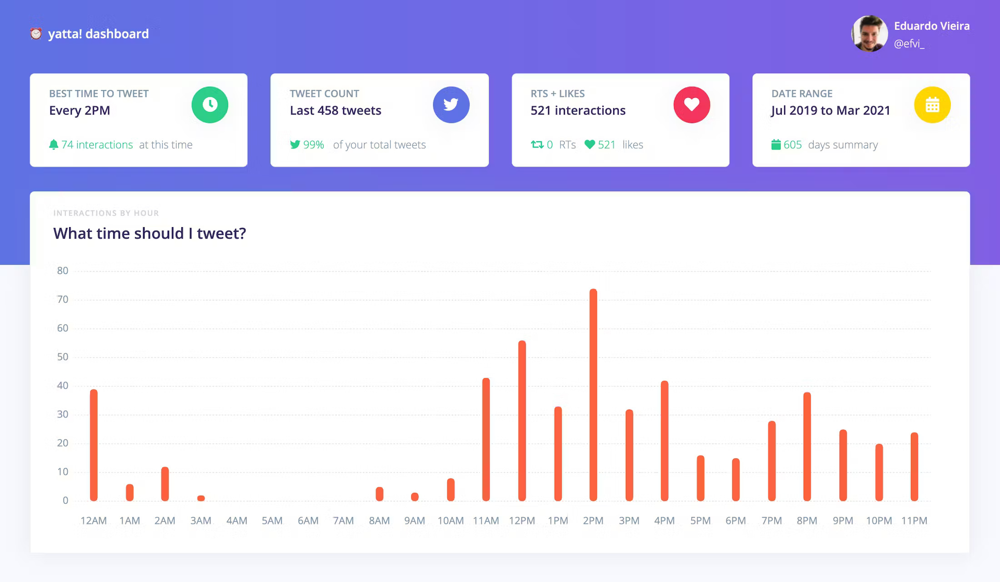

# Yatta Admin Dashboard (`yatta-adm`)

**Yatta!** is a Twitter analytics tool that helps users identify the best times to tweet based on audience engagement. This repository contains the frontend dashboard built with **Angular**, offering clear, interactive visualizations to guide social media strategy.




## 🧩 Features

- 📊 **Tweet Interaction Metrics**: View total likes, retweets, and tweet counts over time.
- 🕒 **Best Time to Tweet**: Highlights the hour of the day with the highest average engagement.
- 📈 **Hourly Interaction Graphs**: Visual breakdown of interactions across 24 hours.
- 📅 **Date Range Filtering**: Analyze interactions from selected timeframes.
- 👤 **Personalized Dashboard**: User-specific data displayed in an intuitive interface.

## 🛠️ Tech Stack

- **Framework**: Angular  
- **Language**: TypeScript  
- **UI**: Responsive component-based dashboard  
- **Charting**: (Assumed) Chart.js or similar for visualizations  
- **State Management**: Angular Services / RxJS  

## 🚀 Getting Started

### Prerequisites

- [Node.js](https://nodejs.org/) (v16+ recommended)
- Angular CLI installed globally:

```bash
npm install -g @angular/cli
```

### Installation

```bash
git clone https://github.com/YOUR-ORG/yatta-adm.git
cd yatta-adm
npm install
```

### Running the App

```bash
ng serve
```

Visit `http://localhost:4200/` in your browser. The app supports live reloading during development.
